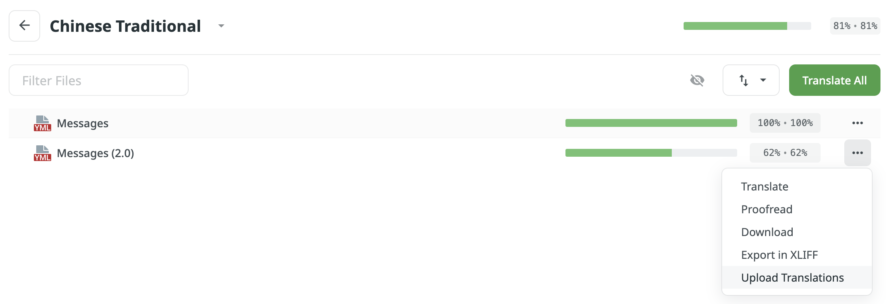

# Messages

The `messages/` folder contains messages and translation files for many languages. All content is translatable, including commands, menus, and chat.&#x20;

The default language of the server can be set using the `default_language` option in `config.yml`. If this does not set everyone to your preferred server language, players can run `/skills lang [language]` to set their own language, where `[language]` is a valid two-letter code that is in the `languages` list in the config (and the file name after `messages_`).

## Editing messages

When editing messages, keep the following in mind:

* Color and formatting is done using the [MiniMessage](https://docs.advntr.dev/minimessage/format.html) format. Legacy Bukkit color codes using `&` will still work.
* Do not change any message placeholders that use `{this}` format. These are replaced by the plugin with contextual data or other messages when shown.
* Do not use the messages file to edit the color or formatting of menus. These can now be done entirely in the config for [menus](menus.md). Menu messages only need to be editing if you want to change the actual text content of the message.
* Newlines are automatically inserted into `menus` messages, ability descriptions, and other messages that appear in menus. You do not need to manually add `\n` anymore.
* Do not touch the file\_version field. It is used to automatically update message files when a new version is available.

### YAML syntax tips

* **Never use tab characters**, only spaces are allowed for indentation. You should use a consistent indentation size (2 spaces) for the entire file.
* If your message starts with the characters "&", "{", or "}", **wrap the entire message in double quotes.** (Ex: "Message"). When in doubt, put it in quotes.

### Units

Any instances of the placeholders `{xp_unit}`, `{mana_unit}`, and `{hp_unit}` are replaced by the values in the `units` section. These placeholders can be added arbitrarily to any message if needed.

## Adding translations

If there isn't a message file for your language, or messages in your language are incomplete, check if it exists on [Crowdin](https://crowdin.com/project/aureliumskills). You can directly translate messages one-by-one there or uploading your completed messages files. If your language isn't listed there, ask on [Discord](https://discord.gg/Bh2EZfB) for it to be added.

<figure><figcaption>
How to upload and download a translation file on Crowdin.
</figcaption></figure>

To upload a messages file, click "Upload Translations". To download messages, click "Download".

If you see blue in the progress bar, it means translations have yet to be approved by a developer/proofreader. These translations will still be included in the downloaded file.

### Translation guidelines

Keep the following guidelines in mind when submitting community translations on Crowdin:

* Do not change or remove colors and formatting tags for messages that have color codes. The style should look the same as the default messages\_en.yml no matter the language.
* Do not remove any placeholders in the default messages
* Try to keep translations as accurate as possible. Translations should not affect the meaning of descriptions and names.
* Don't translate a language if the translation already exists; add to the existing file if it needs to be updated.
* Keep formats as much as possible, such as punctuation, colors, caps, etc. You may need to move around color tags to get the contexts/parameters to match.

### Adding a file

To add a messages file that doesn't already exist, or isn't being loaded, you must add it to the `languages` list or the `default_language` option in `config.yml`. The code must be a valid language code and the same as the suffix in the file name, aka the part after `messages_` but before `.yml`. Some languages have a country code specifier after the language code, which is formatted with a `-` followed by the country code in caps. For example, Brazilian Portuguese has the code `pt-BR`.
