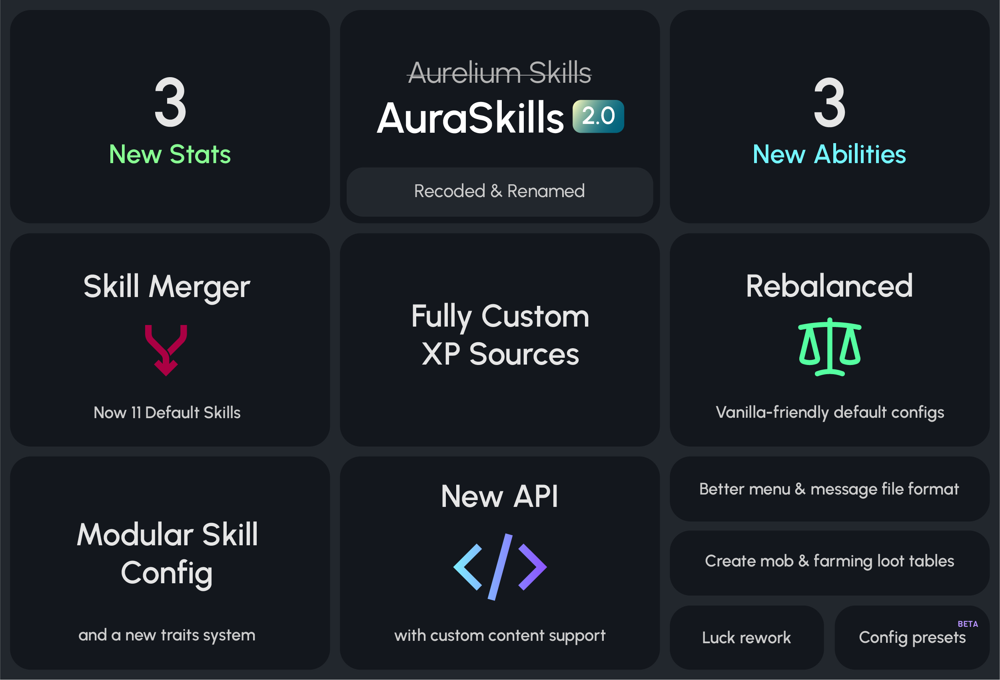

# 2.0

AuraSkills 2.0 is a complete recode of the plugin codebase, overhauling existing systems to make everything more modular and customizable. While many of the changes are behind the scenes stuff like changes to configuration and a [new API](../api.md), there is still some new content that players can enjoy. The default configs have also been simplified and rebalanced through rigorous playtesting, making it fit more seamlessly into the vanilla survival experience.

::: danger
You must read the [Migration](../migration.md) guide if updating from Beta, there are major breaking changes!
:::

<figure><figcaption>
Chart of key features
</figcaption></figure>

## New features

### Customizable XP sources

A completely new and fully customizable [configuration format](../sources.md) has been added for XP sources.

* New config files for configuring sources of each skill in the `sources` folder.
* Each source now has a specific type and options that fully define when XP is gained. For example, all sources for breaking blocks have type `block`.
* New sources can be added just like default ones, with the type options allowing much more customization and control.
* Examples of what is possible:
  * Gaining XP when a player breaks a block matching any specific block state (allows custom blocks).
  * Gaining XP for increasing any Minecraft statistic, like the existing running and walking sources.
  * Gaining XP for consuming a specific item.
  * Gaining XP for enchanting or brewing a custom item.
  * Gaining XP for fishing up a custom item.
* Sources are no longer tied to their default skill, they can be switched around to any skill.

### Modular skill system

The new `skills.yml` file is where individual skills are now configured.

* Abilities and mana abilities are no longer tied to their default skill, they can be moved between skills.
* Custom skills, stats, abilities, and mana abilities can be added using the [API](../api.md#custom-content) in a seamless way.

### New abilities

* New Farming ability: Growth Aura
  * Crops with growth stages within 30 blocks of you grow {value}% faster.
  * Unlocks at Farming 5 by default.
* New Archery ability: Retrieval
  * Arrows you miss will be instantly retrieved after 3s up to {value} blocks away.
  * Unlocks at Archery 1 by default.
* New Fighting ability: Parry
  * Missing a sword swing within 0.25s before being hit reduces damage by {value}% and cancels knockback.
  * Unlocks at Fighting 1 by default.

### New stats

Crit Damage, Crit Chance, and Speed have been added as individual stats.

* The old Crit Chance Archery ability and Crit Chance Fighting ability have been replaced with normal stat rewards, allowing a new ability to be added for each.
* The Speed stat always shows the player's accurate speed, where 100 = 100% (normal) speed. While skills don't directly increase speed by default, you can use it in rewards or modifiers.

### Traits

Traits are a new system that makes stats more modular and configurable.

* A trait represents a single mechanic that a stat changes/improves. For example, the Wisdom stat increases experience gain, reduces anvil costs, and increases max mana. These aspects are now represented as the individual traits experience\_bonus, anvil\_discount, and max\_mana.
* Traits can be moved between stats.
* Both stats and traits can be easily disabled with one option, instead of having to remove every stat reward.
* When linking a trait to a stat, the modifier option determines how much of the trait you gain for each stat level.
* When a trait has a modifier of 1 (meaning it's the same number of the stat), it can be displayed instead of the stat value. This allows the health stat to always display the accurate HP amount you have in menus, including the default 20 HP and HP from other plugins.

### Luck rework

* The Luck stat has been fully reworked to make it more useful. Instead of increasing the Minecraft Luck attribute, which most players don't understand, Luck now increases the new traits Farming Luck, Foraging Luck, Mining Luck, Fishing Luck, and Excavation Luck.
* These traits increase the chance for extra item drops of any XP source of those skills.
* When a player's luck trait is 150 for example, they have a guaranteed +1 drop and a 50% chance for +2 drops.
* Luck traits are also increased by the specific ability in each gathering skill, such as Bountiful Harvest.
* The Triple Harvest Farming ability has been removed, since Bountiful Harvest just increases Farming Luck, doing the same thing.

### Mob and Farming loot tables

* Custom [loot tables](../loot.md) can now be created for killing mobs and harvesting farming crops.
* Create the `loot/mob.yml` file to add mob loot tables and specify specific mob types with the `mobs` pool option.
* Any skill with block sources can now have their own custom loot tables, including farming. Create a file named after the skill, such as `loot/farming.yml`.

## Changes

### Plugin renaming

The plugin has been renamed from AureliumSkills to AuraSkills. This means the data folder is now `plugins/AuraSkills`.

* Why? The new name is shorter, simpler, and more meaningful. The original plugin name didn't have a meaning when first made, and was pretty long to say and type.
* For plugins that hook into AureliumSkills, the renaming means compatibility with Beta versions won't break, and a new hook system can be implemented by developers with the brand new and improved [API](../api.md). Plugins will be able to support both Beta and 2.0 at the same time easily.
* The new data folder allows migration to be implemented more easily, without overriding existing files. This means any problems from migration can be reverted.
* PlaceholderAPI placeholders now use the prefix `%auraskills_`. Old placeholders using `%aureliumskills_` will still work, but you should gradually convert your placeholders over to the new prefix.
* All permissions have been renamed and reorganized. Old ones will not work. See the [permissions list](../permissions.md) for the up-to-date list.

### Skill merging and removal

Because some skills were too slow to level up and had abilities that weren't very useful, some skills have been merged/removed by default. This brings the total skill count from 15 to 11. The existing 15 skills can still be used by applying the legacy config preset using `/skills preset load legacy.zip`.

::: warning
If you migrated from Beta, the legacy preset will be automatically applied and you will still have 15 skills. The points below will not apply.
:::

* Endurance has been merged into Agility.
* Healing has been merged into Alchemy.
* Forging has been merged into Enchanting.
* The XP sources from the removed skills (Endurance, Healing, and Forging) have been added to the skills they merged with, so you can still gain XP in the same way.
* The abilities deemed most useful out of the two skills have been kept, the rest have been not included in default configs.
* No abilities have been deleted, you can still add them back in `skills.yml`.
* Sorcery has been removed from defaults since it never had any abilities.

### Config format

The format and location of config files has signifcantly changed.

* All keys in `config.yml` ([Main config](../main-config/)) now use underscores instead of hyphens.
* [Skill configuration](../skills/#configuration) has been moved to `skills.yml`.
* [Stat configuration](../stats/#configuration) has been moved to `stats.yml`.
* [Ability configuration](../abilities.md#configuration) has been moved to `abilities.yml`.
* [Mana ability configuration](../mana-abilities.md#configuration) has been moved to `mana_abilities.yml`.
* [Sources configuration](../sources.md) has been moved to the `sources` folder.

### Message format

* Messages in the `menus` section, as well as skill, stat, and ability descriptions no longer contain formatting. Formatting is now fully done in the menus configuration.
* Legacy color codes with `&` have been replaced with [MiniMessage](https://docs.advntr.dev/minimessage/format.html) tags. Legacy codes will still work if you want to use them.
* Newlines (\n) have been removed from most messages since menus will insert them automatically through lore wrapping.
* Messages that were the same for every language have been moved to a new `messages/global.yml` file.
* The section for each ability is now directly under `abilities` instead of a section for each skill. This accounts for the fact that abilities can be moved between skills.
* The messages for block and mob names have been removed, as these messages are now replaced on the client-side depending on the language the client is using. This reduces the overall message file size by almost 200 lines.

### Menu format

* Legacy color codes with `&` have been replaced with [MiniMessage](https://docs.advntr.dev/minimessage/format.html) tags. Legacy codes will still work if you want to use them.
* Added menu components, which are lines for certain templates that are inserted into the lore. This allows elements to be hidden/shown when needed while keeping the lore format of the main template clean without a bunch of newline characters.
* Added a `formats` section that defines formats for some items. Most of these were moved from the messages file.
* Added different lore line types, with options for automatically wrapping to new lines if the current line is too long. The style/color of the current line can be maintained for the wrapped line.
* Added groups, which allow contexts to be defined by an order within an area of the menu, instead of a static position. This allows items to be shifted when one is removed/added without changing all the positions. Groups can be set to align at the center, left, or right or their bounding box.
* Placeholders that replace directly from the messages file are now in double curly braces like `{{this}}`. The format indicates that the message is found directly at the message path `menus.menu_name.this` or `menus.common.this`, where `menu_name` is the name of the menu the placeholder is in and `this` is the text inside the double curly braces. The change means you can add arbitrary message placeholders in the menu files, including message keys you added yourself.
* Placeholders in single curly braces are data placeholders replaced by the plugin directly, usually numbers.
* Context sections for templates are now under a `contexts` section instead of directly under the template.
* The unlocked, locked, and in\_progress templates in the level\_progression menu now have their context from 1-max\_level of the skill instead of 1-items\_per\_page. This allows changing the material of a specific level to signify a special reward.

### Menu appearance

The appearance of the default menus has been slightly changed.

* A progress bar for XP has been added to the skill template and in\_progress level\_progression item.
* In the default 11 skill configuration, the 3 combat skills are now on the first row while the 5 gathering skills are on the second. Agility has been moved to the third row.
* The material of loots/amor for each skill item is now all iron.
* The your\_skills item is now a textured information player head.

### Default config values

The following is a list of changes to the default configuration, most of these will not apply if you migrated from Beta.

#### Main config changes

* Added a `start_level` option to the main config to define what skill levels players start at by default. **Players now start at skill level 0, instead of 1**.
* `boss_bar.mode` has been changed to `single`.
* `enable_roman_numerals` is now false.
* Added options to configure the critical hologram colors; the default `damage_holograms.colors.critical.digits` now start at white instead of gray.
* `auto_save.enabled` is now true.

#### Skills changes

* The max level of all skills is now 100 instead of 97.
* Abilities of some skills have been changed due to the skill merging.

#### Stats changes

* The modifier for health and hp is now 1, so the health stat matches the Minecraft HP value. The health stat reward values in the rewards files have been changed to 0.4 to account for this. This means players will see +0.4 Health when leveling, which is accurate to the action bar.
* The `hearts` option in the hp trait has been changed to show more visual hearts earlier to account for less overall possible HP.
* Mana regeneration has been heavily reduced to make mana an actual relevant cost (0.1 to 0.02).
* The modifier for Strength has been decreased from 0.5 to 0.4
* Modifiers for some traits have been scaled differently from the existing stat modifier values.
* Base mana regen is now 0.1 per second instead of 1.
* Overflow mana (over max mana) is no longer allowed.

### Item NBT format

The way item/armor modifiers, requirements, and multipliers are stored on items has changed.

* The new format uses the built-in PersistentDataContainer API instead of an external library dependent on NMS code.
* Old items should be automatically converted to the new format when held.

### Damage

* Most damage modifiers, except Strength, are now additive instead of multiplicative.&#x20;
* This means the percent increases for Crit Damage, tool master abilities, and First Strike will be added together before multiplying the damage.

## Technical changes

### Codebase structure

The codebase has been split into multiple modules to allow the api to be independent from implementation, and opening the possibility for ports to other platforms like Folia or Fabric in the future (not a guarantee).

* `api` - Contains API code not dependent on the Bukkit API
* `api-bukkit` - Contains API code dependent on the Bukkit API, like events. When using the `api-bukkit` dependency, all the code in the `api` module is bundled in.
* `bukkit` - Contains implementation code that requires the Bukkit API, such as implementations for sources, abilities, traits, loot, commands, and menus.
* `common` - Contains the core skills systems not dependent on the Bukkit API, including the registries, most configuration loading, messages, rewards, migration, user management, and storage.

The package for the plugin classes is now `dev.aurelium.auraskills` instead of `com.archyx.aureliumskills`.

### API

> Main article: [API](../api.md)

The 2.0 releases adds a brand-new API that is much more capable and extensive than before. It also supports adding custom content (skills, stats, abilities).

### License

The plugin is now licensed under [GPL3](https://www.gnu.org/licenses/gpl-3.0.en.html). For one, this means that forks or modifications to the plugin that you distribute must also have their source-code available.
